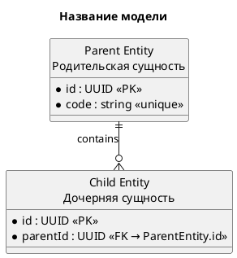

# Промпт: построение ER-диаграммы

Используй этот промпт для создания, изменения или проверки ER-диаграммы любой
предметной области в формате PlantUML.

## Задача

Построй логическую или физическую модель данных на основе предоставленных требований,
контрактов, маппингов, примеров данных, описаний процессов и существующих диаграмм.

Не придумывай сущности, реквизиты, ключи и кардинальности без основания во входных
материалах. Если источники противоречат друг другу или данных недостаточно, сначала
перечисли коллизии и предложи варианты решения.

## Приоритет источников

Если пользователь не установил иной порядок, используй следующий приоритет:

1. Явные решения пользователя в текущей задаче.
2. Утверждённые модели данных и ER-диаграммы.
3. Контракты интерфейсов и схемы сообщений.
4. Таблицы маппинга.
5. Примеры payload и поясняющая документация.
6. Общепринятые практики проектирования.

Не исправляй противоречие молча. Укажи, какие источники расходятся и какое решение
применено.

## Определение сущностей

- Создавай отдельную сущность, если объект имеет самостоятельный жизненный цикл,
  идентификатор, набор реквизитов или используется несколькими другими объектами.
- Не создавай отдельную сущность для простой группы полей, если она не хранится
  отдельно и не имеет самостоятельной идентичности.
- Справочные значения с ограниченным набором кодов и централизованным управлением
  выноси в отдельные сущности-справочники.
- Связующую сущность используй для связи многие-ко-многим или когда сама связь имеет
  собственные реквизиты.
- Не смешивай в одной сущности объекты с разным назначением и жизненным циклом без
  явного обоснования.

## Реквизиты

Для каждого реквизита укажи:

- техническое наименование;
- тип данных;
- обязательность;
- назначение, если оно неочевидно;
- ограничения: уникальность, допустимый диапазон, формат или значение по умолчанию;
- роль ключа, если реквизит является PK или FK.

Правила обозначения:

- обязательный реквизит — `*`;
- первичный ключ — `<<PK>>`;
- внешний ключ — `<<FK → TargetEntity.id>>`;
- уникальный реквизит — `<<unique>>`;
- необязательный реквизит — без `*`, с `<<optional>>`;
- вычисляемый реквизит — `<<derived>>`;
- канонический составной ключ — `<<canonical>>`.

Пример:

```plantuml
entity "Child Entity\nДочерняя сущность" as ChildEntity {
  * id : UUID <<PK>>
  * parentId : UUID <<FK → ParentEntity.id>>
  * code : string <<unique>>
  description : string <<optional>>
}
```

Тип данных должен соответствовать смыслу реквизита. Коды, номера и идентификаторы,
в которых возможны ведущие нули, храни как строки.

## Ключи и идентификаторы

- Каждая самостоятельная сущность должна иметь первичный ключ.
- Для локального первичного ключа допускается UUID, числовой идентификатор или
  естественный ключ, если это явно обосновано.
- Внешний ключ должен явно указывать целевую сущность и реквизит.
- Не смешивай:
  - локальный первичный ключ записи;
  - внешний ключ на другую таблицу;
  - бизнес-идентификатор;
  - интеграционный идентификатор;
  - канонический составной ключ.
- Если значение формируется из нескольких полей, укажи правило формирования и пример.
- Если составной ключ используется для поиска или устранения дублей, отрази уникальное
  ограничение либо явно опиши механизм проверки.

## Связи и кардинальности

Определяй кардинальность с обеих сторон связи и согласовывай её с обязательностью FK:

- `||` — ровно один;
- `o|` — ноль или один;
- `|{` — один или много;
- `o{` — ноль или много.

Примеры:

```plantuml
ParentEntity ||--|| ChildEntity : oneToOne
ParentEntity ||--o{ ChildEntity : oneToMany
ParentEntity |o--o{ ChildEntity : optionalToMany
```

Подписывай связь её бизнес-смыслом или именем ссылочного реквизита. Не используй
кардинальность один-к-одному только потому, что сейчас известен один объект: она должна
следовать из бизнес-правила или ограничения уникальности.

## Нормализация

- Устраняй повторяющиеся группы данных.
- Храни справочные атрибуты в справочнике, а в основной сущности — ссылку на него.
- Не дублируй одно значение в нескольких сущностях без причины.
- Если дублирование требуется для производительности, аудита или снимка состояния,
  отметь это явно.
- Для связи один-к-одному обеспечь уникальность внешнего ключа или используй общий
  первичный ключ.
- Для связи многие-ко-многим создай связующую таблицу с двумя внешними ключами.

## Интеграционные данные

- Отделяй бизнес-реквизиты от транспортных и интеграционных метаданных.
- Указывай, какие идентификаторы приходят из внешней системы, а какие генерируются
  системой-получателем.
- Не изображай транспортную JSON-структуру как таблицу, если она не хранится отдельно.
- Если внешняя структура преобразуется в несколько таблиц, опиши правило разложения
  и заполнения внешних ключей.
- Для идемпотентности укажи ключ дедупликации и уникальное ограничение либо отдельное
  хранилище обработанных событий.

## Именование

- Используй единый стиль технических имён во всей диаграмме.
- Не смешивай `camelCase`, `PascalCase` и `snake_case` без требования проекта.
- Суффикс `Id` используй для идентификатора или внешнего ключа.
- Суффикс `Key` используй для вычисляемого или составного ключа.
- Суффикс `Number` используй для номера, а не для произвольного идентификатора.
- Не используй одно имя для полей с разной семантикой.
- Отображаемое название сущности может быть двуязычным, если это требуется проектом.

## Формат PlantUML

- Файл имеет расширение `.PlantUml`.
- Диаграмма начинается с `@startuml` и заканчивается `@enduml`.
- Используй `entity` для таблиц.
- Используй стабильные алиасы сущностей без пробелов.
- Для читаемости включи:

```plantuml
hide circle
skinparam linetype ortho
```

Общий шаблон:



## Нотации и пояснения

Используй `note` только для правил, которые невозможно однозначно показать структурой:

- формирование составного ключа;
- условное заполнение;
- источник вычисляемого значения;
- правила синхронизации;
- ограничения жизненного цикла.

Не дублируй в нотациях очевидные реквизиты и связи.

## Порядок работы

1. Изучи все указанные источники.
2. Составь список сущностей и их назначения.
3. Определи первичные и внешние ключи.
4. Определи обязательность реквизитов.
5. Установи связи и кардинальности.
6. Проверь необходимость справочников и связующих таблиц.
7. Найди коллизии между источниками.
8. Согласуй неоднозначные или рискованные решения.
9. Создай или обнови PlantUML-файл.
10. Проверь итоговую модель.

## Проверка перед завершением

1. У каждой самостоятельной сущности есть PK.
2. Каждый FK указывает существующую сущность и реквизит.
3. Кардинальности соответствуют обязательности и уникальности FK.
4. Все обязательные поля подтверждены требованиями.
5. Справочные значения нормализованы.
6. Нет необоснованного дублирования данных.
7. Интеграционные и локальные идентификаторы не смешаны.
8. Вычисляемые ключи имеют правило формирования.
9. Названия и типы согласованы между всеми источниками.
10. Все обнаруженные коллизии устранены или явно зафиксированы.
11. PlantUML-синтаксис корректен.

## Результат

Верни:

- созданный или обновлённый `.PlantUml`-файл;
- краткий список принятых решений;
- список оставшихся открытых вопросов и коллизий.
